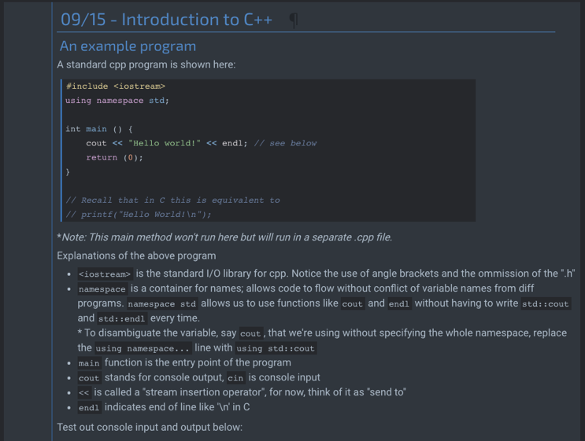

# ECE244: Programming Fundamentals Notes
  

Here you can find my notes for ECE244:Programming Fundamentals (and more generally on C++).  
ECE244 is a course at University of Toronto Computer Engineering. This course teaches basic programming concepts in C++ for people who have learned some C.  
The notes are presented on a Jupyter Notebook with a C++ kernel, so that you can see notes as well as interact with pieces of C++ code.  

**Click on the binder badge above or [here](https://mybinder.org/v2/gh/yvonne-yang/ece244-notebook-env/master?urlpath=git-pull?repo=https://github.com/yvonne-yang/ece244-notebook.git) to launch the notebook.** The first time might take a few minutes as Binder sets up the environment.  

2020 Fall - 2021 Winter.
